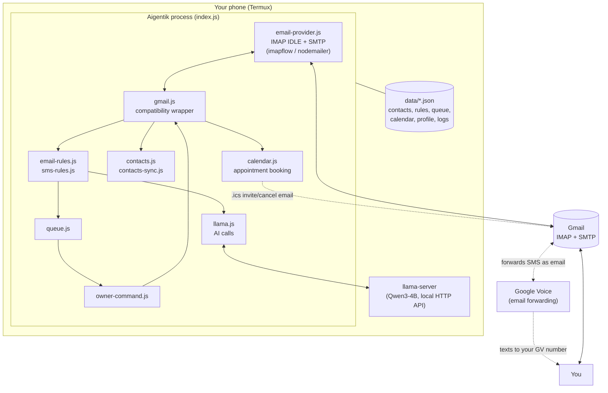

# Aigentik

**Your local AI communications assistant. Runs privately on your device.**

---

## Introduction

Aigentik is a privacy-first AI assistant that runs locally — on an Android phone via Termux, or on a regular Linux box. It watches your Gmail inbox in real time, drafts and sends replies using a local language model, and lets you control it in plain English — no fixed command syntax to learn — by simply texting or emailing it directly, all without a single byte of your mail or messages leaving the device.

It can:

- Monitor Gmail in real time and draft or auto-send replies
- Handle Google Voice text conversations through that same inbox
- Take commands from you in plain English, by text or email — reply to something, add a rule, pause everything, rename itself, and more
- Manage appointments end-to-end — negotiate a time, book it, send a real calendar invite, handle reschedules and cancellations
- Maintain a contact directory that builds itself from everyone who reaches out
- Apply automation rules so routine mail never needs AI or your attention
- Take on a business persona once you tell it who it works for

**No cloud AI. No external API keys. No server. No subscription service.** The model, the inbox connection, and all of your data stay on the device you run it on.

## Why Aigentik Instead of Paying for a Service?

Many AI receptionist and virtual answering services charge recurring monthly fees, often ranging from **$100–$400+ per month**. Aigentik takes a different approach:

| Traditional AI Services | Aigentik |
|---|---|
| Monthly subscription fees | One-time setup |
| Cloud-hosted AI | Runs locally |
| Customer data stored externally | Data stays on your device |
| Limited customization | You control the system |
| Dependent on a service provider | You own the software |

With Aigentik:

- One-time setup, not a recurring bill
- No monthly AI subscription
- Runs on a phone you already own, or an affordable mini PC
- Your customer conversations remain private
- Handles email, Google Voice messages, and appointment scheduling
- Can become the communication assistant for your personal life or your business

The goal is simple: **build an AI assistant you own instead of renting one forever** — one that helps you respond faster, automate routine communication, and cut down on missed messages.

## Features

- Local LLM inference with `llama.cpp` — no cloud calls for AI
- Gmail IMAP real-time monitoring (IDLE, no polling)
- Google Voice SMS handling through the same inbox
- Automatic replies, with a human-approval queue for anything not auto-sent
- Natural-language command control — no fixed syntax, control it by texting or emailing it directly
- Contact intelligence — builds and enriches its own directory automatically
- Business identity/persona — speaks as your business once you tell it who you are
- Appointment scheduling with real calendar invites (`.ics`), no calendar API or OAuth
- Rule engine automation for email and SMS (spam/auto-reply/review)
- Privacy-first architecture — nothing leaves the device except actual mail traffic

## Architecture



Everything runs as one long-lived Node.js process with a single IMAP connection watching Gmail in real time. All AI calls are local HTTP requests to `llama-server` on `127.0.0.1` — nothing goes further than that unless it's actual mail traffic to Gmail. Google Voice texts arrive as forwarded email, so the same pipeline handles both channels. Appointments reach real calendars as standards-based `.ics` invites over that same connection — no calendar API, no OAuth. Full breakdown: [Architecture](docs/architecture.md).

## Quick Comparison

| Feature | Aigentik | Cloud AI Assistant |
|---|---|---|
| Local AI | Yes | Usually no |
| Monthly subscription | No | Usually yes |
| API key required | No | Usually |
| Data stays local | Yes | Depends |
| Gmail automation | Yes | Limited |
| Google Voice support | Yes | Rare |
| Custom business persona | Yes | Limited |

## Quick Start

```bash
git clone https://github.com/Ishabdullah/Aigentik-CLI.git ~/Aigentik-CLI
cd ~/Aigentik-CLI
./install.sh
```

`install.sh` installs system packages, builds `llama.cpp`, downloads a GGUF model, runs `npm install`, and generates a starter `config.json` — idempotent, safe to re-run, works on both Termux and Linux. When it finishes, it tells you exactly what's left: a Gmail App Password, Google Voice forwarding, and a few fields in `config.json`.

Full walkthrough, requirements, and the manual install path: **[docs/installation.md](docs/installation.md)**.

## Documentation

The details that don't fit on a homepage live in [`docs/`](docs/):

| Doc | Covers |
|---|---|
| [installation.md](docs/installation.md) | Requirements, quick/manual install, Termux vs. Linux, running Aigentik |
| [configuration.md](docs/configuration.md) | Every `config.json` field |
| [architecture.md](docs/architecture.md) | System diagram, the two communication channels, message-processing flow, source file map |
| [commands.md](docs/commands.md) | Every owner command, the review queue |
| [scheduling.md](docs/scheduling.md) | The appointment negotiation/booking/reschedule/cancel system |
| [contacts.md](docs/contacts.md) | The self-building contact directory |
| [rules.md](docs/rules.md) | Email/SMS rule engines |
| [onboarding.md](docs/onboarding.md) | First-run setup email, business identity & persona |
| [security.md](docs/security.md) | Privacy and security model |
| [troubleshooting.md](docs/troubleshooting.md) | Common problems, known limitations |
| [testing.md](docs/testing.md) | Running the test suite |
| [data-files.md](docs/data-files.md) | What's stored under `data/` |

## License

MIT
