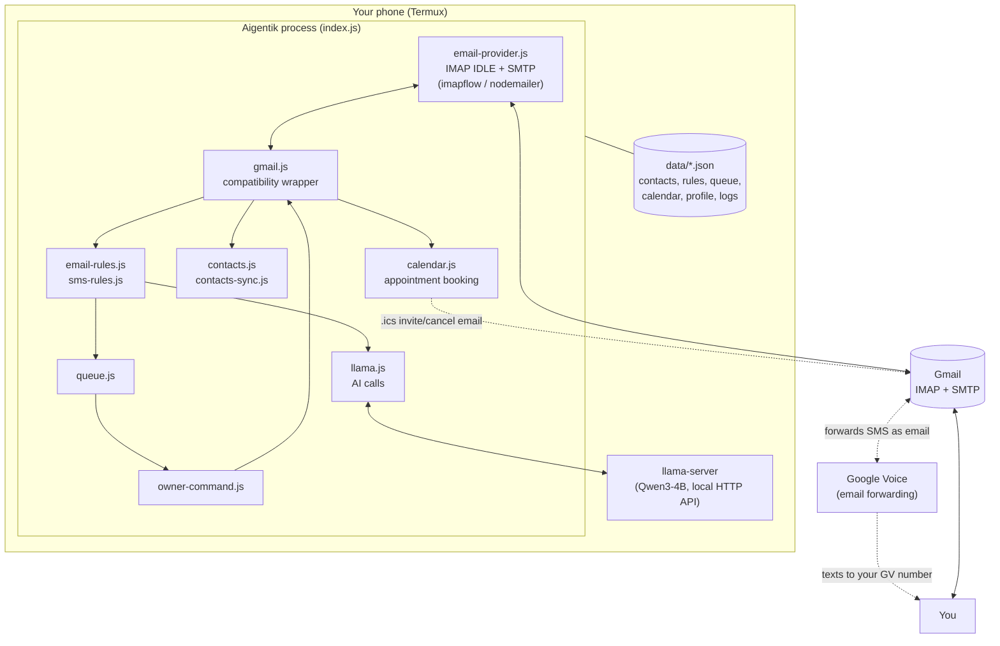

# Aigentik

**Aigentik** is a personal AI assistant that runs entirely on your Android phone (via Termux). It watches your Gmail inbox in real time, drafts and sends replies using a local language model, and lets you control it in plain English — all without a single byte of your mail or messages leaving the device.

There is no cloud AI, no external API key, and no server. The model, the inbox connection, and all of your data live on the phone.

---

## Table of Contents

1. [What it does](#what-it-does)
2. [How it's built](#how-its-built)
3. [Requirements](#requirements)
4. [Installation](#installation)
5. [Configuration reference](#configuration-reference)
6. [Running Aigentik](#running-aigentik)
7. [First-run onboarding](#first-run-onboarding)
8. [Business identity and persona](#business-identity-and-persona)
9. [The two communication channels](#the-two-communication-channels)
10. [Who Aigentik listens to as "the owner"](#who-aigentik-listens-to-as-the-owner)
11. [What happens to an incoming email, step by step](#what-happens-to-an-incoming-email-step-by-step)
12. [What happens to an incoming Google Voice text, step by step](#what-happens-to-an-incoming-google-voice-text-step-by-step)
13. [Owner command reference](#owner-command-reference)
14. [The review queue](#the-review-queue)
15. [Rule engines](#rule-engines)
16. [The contact directory](#the-contact-directory)
17. [Appointment scheduling](#appointment-scheduling)
18. [Data files](#data-files)
19. [Source file reference](#source-file-reference)
20. [Testing](#testing)
21. [Troubleshooting](#troubleshooting)
22. [Security notes](#security-notes)
23. [Known limitations](#known-limitations)
24. [License](#license)

---

## What it does

- **Reads your Gmail inbox in real time** over IMAP IDLE — the instant a new message lands, Aigentik sees it. No polling.
- **Drafts a reply using a local LLM** (Qwen3-4B, served by `llama.cpp` on the same device) and either sends it automatically or queues it for your approval, depending on your rules.
- **Handles Google Voice texts through the same pipeline.** Google Voice forwards incoming SMS as email; Aigentik parses those forwarded emails back into text-message-shaped objects and replies to them the same way Google Voice delivered them — by replying to the forwarded email, which Google Voice turns back into an SMS on the other end.
- **Takes commands from you** — either by texting your Google Voice admin number, or by emailing it directly from your own address — and acts on them: reply to something in the queue, add a rule, mark something as spam, pause everything, rename itself, and more. Commands are understood via natural language, not a fixed syntax.
- **Builds a contact directory automatically** from everyone who emails or texts in, merged with your phone's real contacts, so it knows who's who and can apply per-person instructions ("never reply to X", "always reply to Mom").
- **Applies rules** you define ("spam anything from *.marketing.com", "auto-reply to my boss") before ever generating a reply, so routine mail doesn't need AI or your attention at all.
- **Takes on a business persona once you tell it who it works for.** Out of the box Aigentik is a generic personal assistant; tell it "the business name is Acme Restoration and we're a home improvement company specializing in water damage restoration" and every reply, signature, and Q&A answer afterward speaks as that business's secretary instead. See [Business identity and persona](#business-identity-and-persona).
- **Asks for that setup information itself on first run**, by email, if it isn't set yet — no manual config file editing needed for the owner's name or business info. See [First-run onboarding](#first-run-onboarding).

## How it's built



Everything after "Gmail" is one long-lived Node.js process (`index.js`) with a single IMAP connection sitting in `IDLE`, plus a small pool of extra IMAP connections opened only for bulk operations (delete/archive/spam-scan/search) so they don't block the main inbox watcher. All AI calls are plain HTTP requests to `llama-server` running on `127.0.0.1:8080` — nothing goes further than that unless it's actual mail traffic to Gmail's IMAP/SMTP servers. Appointment scheduling (`calendar.js`) works the same way: no calendar API, no OAuth — bookings reach real calendars as standards-based `.ics` invite emails sent over that same SMTP connection (see [Appointment scheduling](#appointment-scheduling)). Natural-language date/time phrases are resolved deterministically by `chrono-node`, not guessed by the local model.

## Requirements

- An Android device with **Termux** and **Termux:API** installed (grant it Contacts permission — that's the only Android permission Aigentik still needs)
- **Node.js 18+**
- **llama.cpp**, built with the `llama-server` binary
- A **GGUF model** — this project is tuned around Qwen3-4B-Instruct, but any chat-completions-compatible model llama-server can serve will work
- A **Gmail account** with an **App Password** (IMAP/SMTP access, not your normal password)
- A **Google Voice number**, with SMS forwarding to that Gmail account turned on

## Installation

### 1. Termux & Termux:API

Install both from F-Droid (the Play Store builds are outdated and unsupported for this kind of use). Open Termux:API's Android permission screen once and grant **Contacts** access.

### 2. Node.js

```bash
pkg install nodejs git cmake make
```

### 3. Build llama.cpp

```bash
git clone https://github.com/ggerganov/llama.cpp
cd llama.cpp
mkdir build && cd build
cmake .. -DLLAMA_CURL=OFF -DGGML_OPENMP=ON
make -j$(nproc)
# binary ends up at ./bin/llama-server
```

### 4. Get a model

Download a GGUF chat model and place it somewhere under your home directory, e.g.:

```
~/models/qwen3-4b-instruct/Qwen3-4B-Instruct-2507-Q4_K_M.gguf
```

### 5. Clone and install Aigentik

```bash
git clone https://github.com/Ishabdullah/Aigentik-CLI.git ~/Aigentik-CLI
cd ~/Aigentik-CLI
npm install
```

### 6. Configure

```bash
cp config.json.example config.json
```

Edit `config.json` — see the [full reference below](#configuration-reference) for every field. At minimum you need to fill in `gmail.email`, `gmail.app_password`, `owner.admin_number*`, and `owner.admin_email`.

`config.json` is git-ignored on purpose — it holds your Gmail app password. Never commit it.

### 7. Turn on Google Voice email forwarding

In Google Voice: **Settings → Messages → Forward text messages via email**, pointed at the same Gmail account in `config.json`. Incoming texts will now arrive in that inbox as emails from `txt.voice.google.com`, and Aigentik does the rest.

## Configuration reference

Every field in `config.json`, in full:

```jsonc
{
  "owner": {
    "admin_number": "15551234567",              // your phone number, digits only
    "admin_number_formatted": "+15551234567",    // same, E.164 — used when composing
    "aigentik_number": "15559876543",            // the Google Voice number Aigentik answers on
    "aigentik_number_formatted": "+15559876543",
    "admin_email": "you@gmail.com"               // your personal email — treated exactly like admin_number for commands
  },
  "gmail": {
    "email": "aigentik@gmail.com",               // the account Aigentik logs into
    "app_password": "xxxx xxxx xxxx xxxx",       // 16-char Gmail App Password, NOT your login password
    "imap_host": "imap.gmail.com",
    "imap_port": 993,
    "smtp_host": "smtp.gmail.com",
    "smtp_port": 587
  },
  "llama": {
    "host": "http://127.0.0.1:8080",             // where llama-server listens
    "model": "...",                              // model name/path passed in chat requests
    "model_path": "~/models/.../model.gguf",     // path llama-server is launched with (~ expands to $HOME)
    "llama_server_path": "/path/to/llama-server", // the built binary
    "context_size": 4096,
    "max_tokens": 512,                           // per-reply generation cap
    "temperature": 0.7,
    "threads": 4
  },
  "sms": {
    "poll_interval_ms": 30000,                   // unused by any currently active code path (legacy)
    "max_sms_fetch": 10                          // unused by any currently active code path (legacy)
  },
  "behavior": {
    "paused": false,                             // true = ignore everything on every channel
    "pause_email": false,                        // true = stop auto-replying/queuing email specifically
    "pause_sms": false,                          // true = stop auto-replying/queuing Google Voice texts specifically
    "require_confirmation_for_destructive": true,// documented intent; the confirmation flow itself is always on regardless
    "default_unmatched_action": "auto-reply",    // what to do with an EMAIL that matches no rule
    "default_unmatched_sms_action": "review",    // what to do with a GOOGLE VOICE TEXT that matches no rule
    "tone_matching": true                        // documented intent; tone detection always runs for SMS-shaped replies
  },
  "paths": {
    "data_dir": "/data/data/com.termux/files/home/Aigentik-CLI/data",
    "logs_dir": "/data/data/com.termux/files/home/Aigentik-CLI/data/logs",
    "conversations_dir": "/data/data/com.termux/files/home/Aigentik-CLI/data/conversations" // reserved, not currently used
  }
}
```

A few fields are worth calling out specifically:

- **`owner.admin_email`** is new: an email arriving from this address is routed straight into the same command interpreter as a text from `admin_number` — see [Who Aigentik listens to as "the owner"](#who-aigentik-listens-to-as-the-owner).
- **`sms.*`** exists in the config schema but nothing in the current codebase reads it — it's left over from an earlier version that polled a Termux SMS inbox directly. Harmless to leave as-is.
- **`behavior.require_confirmation_for_destructive`** and **`behavior.tone_matching`** describe intended behavior that isn't actually gated behind these flags in code today — the confirmation flow for destructive actions and tone detection both always run. Toggling these currently has no effect.

## Running Aigentik

```bash
cd ~/Aigentik-CLI
./start.sh    # starts llama-server if it isn't already running, then Aigentik itself
```

`start.sh` checks that Node.js and Termux:API are installed and that `config.json` has a Gmail address filled in, then launches `node index.js` in the background with output redirected to `aigentik.log`.

```bash
tail -f ~/Aigentik-CLI/aigentik.log   # watch it live
./stop.sh                             # stop it
```

On startup, in order: it starts (or confirms) `llama-server`, warms it up with a test completion, loads your profile (Aigentik's name, your name, business identity) from `data/profile.json` — creating it with everything but Aigentik's own name left blank if this is a fresh install — does a one-time sync of your Android contacts, connects to Gmail and starts the IMAP IDLE watch, and finally either emails you an "I'm online" notification, or, if the owner's name or business info is still missing, an onboarding request instead (see below). From then on it just sits in `IDLE`, woken up only by actual mailbox changes.

Shutdown (`Ctrl+C` or `SIGTERM`) logs out of IMAP and closes the SMTP transporter cleanly before the process exits.

## First-run onboarding

`data/profile.json` isn't checked into git, so a brand-new install starts with no owner name and no business info — only Aigentik's own name (`Aigentik`) is set by default. On every startup, `index.js`'s `sendOnboardingEmail()` checks whether `owner_name` and/or `business_name` are still unset; if so, and it hasn't already sent this request (`profile.json`'s `onboarding_sent` flag), it emails `admin_email` asking for whichever is missing:

> 👋 Hi! I'm Aigentik, your new AI assistant.
>
> Before I start replying to emails and texts on your behalf, I need a couple things:
>
> - Your name, so I know what to call you
> - Your business name
> - A short description of what your business does
>
> Just reply to this email in your own words, filling in the blanks...

Reply to that email in plain language — e.g. *"My name is Sarah. The business is Acme Restoration, a home improvement company specializing in water damage restoration."* The reply is picked up by the normal admin-email path (see [Who Aigentik listens to as "the owner"](#who-aigentik-listens-to-as-the-owner)) and interpreted by the same natural-language command pipeline as everything else: `interpretCommand` (in `llama.js`) recognizes it as `set_business_info` (optionally carrying `owner_name` alongside it if you introduce yourself in the same message) or `set_owner_name` if you only give your name. Both get written to `profile.json` and applied immediately — no restart needed.

The onboarding email is sent once per install, not on every restart (so a crash-loop doesn't spam the admin inbox), but the admin can answer it — or set/change either field later with an ordinary command — at any time; see [set_business_info in the owner command reference](#owner-command-reference). Your Android contacts are synced on every startup regardless of onboarding state (see [The contact directory](#the-contact-directory)), so a fresh install picks up your real contacts immediately even before you've answered the onboarding email.

## Business identity and persona

By default Aigentik is a generic personal assistant, replying "on behalf of [owner]" with no company affiliation. Once `business_name` is set (via onboarding or the `set_business_info` command — see [Owner command reference](#owner-command-reference)), it takes on that business's persona instead:

- **Email and SMS replies** (`generateEmailReply`/`generateSmsReply` in `llama.js`) get an extra system-prompt clause — built by `businessContext()` — telling the model it works as the secretary/personal assistant for that business, optionally with a description of what the business does, so replies and any Q&A about "what do you do" answer in character.
- **The intake acknowledgment** (`generateAcknowledgment`, used when opening the combined intake form for a fresh appointment request) gets the same business context instead of a hardcoded "home services business" assumption.
- **Reply signatures switch too.** With no business set, replies sign off "`<Agent>` | Personal Agent of `<Owner>`" and mention reaching the owner by name for anything urgent. Once a business is set, they sign "`<Agent>` | `<Business>`" instead and drop the owner's personal name from the customer-facing signature entirely — anything urgent gets a generic "reply and we'll get back to you" instead.

Check what's currently set anytime with `business info` / `company info` / `who do you work for`. Restating just a business name preserves its last-set description; naming a *different* business without a description clears the old one rather than inheriting it.

Note: the appointment-negotiation templates (the closing reassurance line about "qualified technicians," the intake form wording) are still hardcoded for a home-improvement-style business and don't adapt to `business_description` — they happen to fit a business like Acme Restoration, but a business in an unrelated trade would want to edit `closingReassurance()` and `sendIntakeForm()` in `index.js` directly.

## The two communication channels

Aigentik has exactly two ways in and out: **Gmail**, and **Google Voice through Gmail**. There is no direct SMS sending or receiving on the device itself — an earlier version of this project did poll and send SMS directly through Termux:API, but that entire path (`sms-send.js`, `sms-inbox.js`, `sms-public.js`, and a first-run setup wizard built on it) has been removed, because it had no way to work consistently with the "everything through Gmail" design and there's no way to originate a brand-new, unprompted text message through Google Voice's email interface anyway (only *replying* to an existing forwarded thread works by email).

**Practical effect:** Aigentik can reply to a Google Voice text once it's arrived, but it cannot start a new, out-of-the-blue text conversation with someone who hasn't texted the Google Voice number first. If you ask it to "text Mom hi", it will tell you it can't and suggest emailing her instead.

### Email

Handled by `email-provider.js` (the actual IMAP/SMTP client, built on `imapflow` and `nodemailer`) and `gmail.js` (a thin compatibility wrapper other modules import from, so nothing else needs to know `imapflow` exists). One connection stays in `IDLE`; the moment Gmail reports the message count went up, Aigentik fetches whatever's unseen, marks it seen by its exact IMAP UID, and hands each parsed message to `index.js`'s `handleNewEmail`.

A few things about this that matter if you're debugging behavior:

- **Only mail received after Aigentik started is processed.** The startup timestamp is recorded once at boot; anything already unread in the inbox from before that is skipped, so restarting Aigentik never triggers a flood of replies to old mail.
- **Sending never blocks receiving.** New-mail handling and any bulk management operation (delete/archive/spam-scan) go through separate IMAP connections, so a long "scan and spam promotional mail" pass doesn't stall the live inbox watch.
- **A new-mail check never runs twice at once.** If two mailbox changes land close together (for instance, your own reply landing back in the inbox right after being sent, immediately followed by a real new message), the second check waits for the first to finish rather than running concurrently against the same connection.

### Google Voice (via Gmail)

Google Voice doesn't give this project any direct API access — instead, it forwards every incoming text as an email (from an address under `txt.voice.google.com`) into the same Gmail inbox Aigentik is already watching. `email-provider.js` recognizes these by their subject line format ("New text message from ...") and parses them into an SMS-shaped object: sender name, sender phone number, message body, and — critically — the original forwarding email's address and subject, which is what makes it possible to *reply* later (Aigentik replies to that forwarded email; Google Voice turns the reply back into a real text on the wire).

## Who Aigentik listens to as "the owner"

Two things are treated identically as "a command from the owner, not a message to auto-reply to":

1. **A Google Voice text from `owner.admin_number`** (checked against the last 10 digits, so formatting doesn't matter).
2. **An email from `owner.admin_email`**, sent directly to the Gmail account Aigentik monitors.

Both get built into the same lightweight shape (`{ address, body, _id }`) and handed to `owner-command.js`'s `handleOwnerCommand`, so every command in the [reference below](#owner-command-reference) works identically from either channel.

For the email path specifically: if you reply to one of Aigentik's own notification emails instead of composing a fresh one, Gmail will append the old message underneath yours, quoted, with an "On [date], Aigentik wrote:" header. Aigentik strips that quoted block (and any `-----Original Message-----` or `>`-quoted block) before treating the remainder as your command, so the leftover quoted text doesn't get fed into the interpreter along with your actual instruction.

## What happens to an incoming email, step by step

1. **IMAP IDLE fires.** `email-provider.js` fetches the new message(s), marks each seen by UID, and calls back into `index.js` with the parsed email.
2. **Sender check.** If it's from Aigentik's own address, it's ignored (this is what stops "I sent myself a copy" or notification loops). If it's a Google Voice forwarded text, it's routed to the Google Voice handler instead (see below). If it's from `admin_email`, it's routed to the owner-command handler instead (see above). Otherwise, it's a normal inbound email and processing continues.
3. **Contact lookup.** `contacts.findOrCreateByEmail` either finds the sender in the contact directory or creates a new entry, and a history entry is recorded against it.
4. **Rule check.** `email-rules.js` checks the sender, subject, and body against your saved rules, in order, first match wins. If nothing matches, the configured default (`behavior.default_unmatched_action`, normally `auto-reply`) applies.
5. **If the rule action is `spam`**, the sender's mail is moved to Gmail's Spam folder and nothing else happens.
6. **Otherwise, an AI reply is drafted** via `llama.js`'s `generateEmailReply`, using the sender's name, the subject/body (truncated), any per-contact relationship/instructions you've set, and your and Aigentik's names — with a signature appended automatically.
7. **Auto-reply or queue.** If the rule (or the default) says `auto-reply`, the draft is sent immediately via `gmail.sendReply`, and you get a short notification email confirming what was sent. Otherwise, the draft is pushed onto the review queue with a numbered `display_id`, and you get a notification with the draft and a `reply [#]` prompt.

## What happens to an incoming Google Voice text, step by step

1. Steps 1–2 above are shared — it arrives as email, gets parsed, and is recognized as a Google Voice message before the "regular email" path ever runs.
2. **Sender check.** If the *sender's phone number* matches `admin_number`, it's a command — handed to `owner-command.js` exactly like an admin email (see above). Otherwise, it's a public message and continues below.
3. **Contact lookup and history**, same as email.
4. **Urgent-keyword check.** If the message body contains your name (`owner_name`, from `profile.json`), you get a separate 🚨 urgent notification regardless of anything else that happens.
5. **Contact behavior check.** If you've told Aigentik to "never reply" to this contact, processing stops here.
6. **Rule check**, via `sms-rules.js` — by phone number, message content, or both. `spam` short-circuits the same way it does for email.
7. **Tone detection**, then an AI reply via `generateSmsReply` — shorter and more casual than the email version, with its own signature.
8. **Auto-reply or queue**, same shape as email: either `gmail.replyToGoogleVoiceText` sends it immediately (which Google Voice turns back into a real SMS), or it's queued with the forwarding email's address and subject saved alongside it, so a later manual approval can still reply correctly.

## Owner command reference

Say/text/email any of these to the admin number or `admin_email`. A handful of exact phrases are handled directly (fast, no AI call); everything else goes through the local LLM to interpret intent, so you don't need to match these verbatim — "what's pending" works the same as "list".

### Direct phrases (no AI needed)

| Say | Does |
|---|---|
| `list` / `pending` / `queue` | Show everything waiting in the review queue |
| `status` / `ping` | Health check: paused state, pending count, per-channel status |
| `email rules` / `list email rules` | List saved email rules |
| `sms rules` / `list sms rules` | List saved Google Voice rules |
| `contacts` / `list contacts` | List the contact directory |
| `sync contacts` / `refresh contacts` / `sync` | Re-sync from your phone's Android contacts |
| `email [name] about [topic]` / `email [name] re [topic]` | Draft and send a fresh email to a saved contact |
| `rename [name]` | Change what Aigentik calls itself |
| `business info` / `company info` / `who do you work for` | Show the currently set business name/description |

### Natural-language commands

Everything else is sent to the local model with a short JSON schema to fill in, then executed. Roughly:

| Intent | Example phrasing | What happens |
|---|---|---|
| Approve a queued reply | `reply 3` | Sends the queued draft for item #3, via email or (for Google Voice items) by replying to the original forwarded email |
| Edit a queued draft | `edit 3 tell them I'll call tomorrow` | Replaces the draft text for item #3 |
| Dismiss a queued item | `skip 3` | Removes item #3 without sending anything |
| Spam a queued item | `spam 3` | Moves that exact message to Gmail Spam (by its IMAP UID) and removes it from the queue |
| Add a rule | `add email rule: spam anything from amazon.com` | Parses the description into a structured rule and saves it |
| Remove a rule | `remove rule spam anything from amazon` | Finds a saved rule by id or matching description and deletes it |
| List rules | `list rules` / `list sms rules` | Same as the direct-phrase versions |
| Find a contact | `find Sarah` | Looks up and returns saved info for a contact |
| Per-contact instructions | `always reply to Mom` / `never reply to spam caller` / `for my boss, always mention I'm in meetings until 3` | Sets that contact's reply behavior (`always` / `never` / `auto`) and optional standing instructions |
| Add a contact | `add contact Sarah phone 5551234567` | Creates the contact if it doesn't exist yet, or adds the phone/email to an existing one |
| Update a contact | `save email john@x.com to Mike` / `change Mike's name to Michael` | Adds a phone/email/relationship/notes, or overwrites the name, on an existing contact |
| Send an email | `email boss@company.com about the meeting` (or with a saved contact name) | Drafts content via AI and sends, asking for confirmation first if the model flags it as needing one |
| Pause/resume | `pause` / `pause email` / `pause sms` / `resume` / `resume email` / `resume sms` | Globally or per-channel stop/start processing |
| Generate content | `write a birthday message for my daughter` | Returns AI-generated text without sending it anywhere |
| Book an appointment | `book John for next tuesday at 2pm` (or `book jane@example.com for...` directly) | Finds the nearest available slot at/after that time within working hours, books it, and emails a calendar invite to the other party and to you. Never books *today* unless you say "today"/"tonight" |
| Move an appointment | `move John's appointment to friday 3pm` | Reschedules John's nearest upcoming appointment and resends an updated invite |
| Cancel an appointment | `cancel John's appointment` | Confirmation-gated — see below |
| List appointments | `what's on my calendar` / `what's on my calendar today` / `... for next tuesday` / `... this week` | Shows upcoming appointments, or just the day/range you asked about |
| Set working hours | `set working hours 9am to 5pm monday through friday` | Updates the hours Aigentik will book appointments within |
| Set duration by role | `lawyers get 60 minute appointments` | Sets a default appointment length for contacts with that relationship label |
| Set business identity | `the business name is Acme Restoration and we do home improvement, specializing in water damage restoration` | Sets `business_name`/`business_description` — see [Business identity and persona](#business-identity-and-persona). Can also set the owner's name in the same message, e.g. `my name is Sarah, the business is Acme Restoration...` |
| Set owner's name only | `my name is Sarah` | Sets `owner_name` without touching business info — used when no business is being set |
| Anything unrecognized | — | Falls back to a plain conversational reply from the model |

### Confirmation-gated (destructive) commands

These never run immediately — Aigentik describes what it's about to do and waits for you to reply `yes`/`confirm` or `no`/`cancel` before touching anything:

| Say | Does, once confirmed |
|---|---|
| `delete all emails` | Permanently deletes (moves to Trash) every message in the inbox |
| `archive all emails` / `clean inbox` | Archives (moves to All Mail) every message in the inbox |
| `spam all promotional emails` | Scans every inbox message, evaluates each one against the same promotional-content check used for auto-detection, and moves only the matches to Spam — reports back how many were scanned vs. actually moved |
| `delete contact [name]` | Permanently removes that contact from `contacts.json` |
| `cancel [name]'s appointment` | Cancels the appointment and emails a cancellation notice (matching `.ics` `CANCEL`) to both the contact and you |

Only one confirmation can be pending at a time; if you say anything other than yes/no while one is outstanding, the pending action is discarded and your new message is processed as a fresh command.

### What Aigentik can't do

- **Start a brand-new text conversation.** `send_sms` and the old `text [name] [message]` shorthand are gone — see [The two communication channels](#the-two-communication-channels) for why. Use email instead, or reply to a text that's already in the queue.
- **Target one message when spamming an item that predates this feature.** Every item queued now carries the exact message's IMAP UID, so `spam [#]` moves only that message. Items already sitting in the queue from before this existed have no stored UID and fall back to spamming everything from that sender.

## The review queue

Anything not auto-replied lands in `data/pending.json` with a small integer `display_id` (starting at 1 and always increasing, so IDs never get reused even after items are removed). Each item records the sender, subject/body preview, the AI-drafted reply, which saved contact it's linked to (if any), and — for email and Google Voice items — enough information (message UID, and for Google Voice, the forwarding email's address/subject) to act on the *exact* original message later, not just "whoever sent this."

`reply [#]`, `edit [#] [...]`, `skip [#]`, and `spam [#]` all operate against this queue. There's no expiry — items sit there until you act on them.

## Rule engines

Two independent, structurally identical rule engines: `email-rules.js` for email, `sms-rules.js` for Google Voice texts. Each rule has a `condition_type`, a `condition_value` to match against, and an `action`. Rules are checked in order; the first match wins; if nothing matches, the configured default action applies.

**Email conditions:** `from`, `domain`, `subject_contains`, `body_contains`, `promotional` (matches against a built-in keyword list — unsubscribe links, "no-reply" senders, "newsletter", etc.), `any` (matches from/subject/body).
**Email actions:** `auto-reply`, `review`, `spam`.

**Google Voice conditions:** `from_number`, `message_contains`, `any`.
**Google Voice actions:** `auto-reply`, `review`, `spam`.

Every rule tracks its own `match_count` and `last_matched` timestamp, so `email rules` / `sms rules` shows you how often each one is actually firing.

Add rules conversationally — `add email rule: auto-reply to anything from boss@company.com`, `add sms rule: spam messages containing "you've won"` — the model parses your description into the structured fields above. Remove them the same way: `remove rule [description or id]`.

## The contact directory

`data/contacts.json` is a flat list Aigentik builds and maintains itself. Every inbound email or text either matches an existing contact (by normalized phone number, normalized email, name, or alias) or creates a new one automatically. Each contact tracks: name, any known aliases, phone numbers, email addresses, a home/mailing address, a free-text relationship label ("boss", "wife"), a type (`person`/`business`/`unknown`), standing instructions, a reply behavior (`auto` / `always` / `never` / `review`), where it came from (`email`, `sms`, `android_contacts`, or `auto`), first-seen/last-contact timestamps, a running contact count, and up to the last 50 history entries.

`sync contacts` merges in your actual Android address book (via `termux-contact-list`) without ever overwriting data Aigentik has already learned — it only fills in a name if one's missing, and adds phone numbers/aliases it doesn't already have.

Reply behavior per contact overrides the general rule engine: setting someone to `never` stops all processing for them outright (still logged, no reply, no queue item); `always` skips the rule engine and auto-replies unconditionally.

## Appointment scheduling

Aigentik can negotiate, book, reschedule, and cancel appointments from incoming emails and Google Voice texts — entirely without a calendar API or OAuth. It's the same self-hosted pattern as the contact directory: `calendar.js` is the source of truth, backed by two flat files, and events reach your real calendar as standards-based `.ics` invite emails rather than through any third-party integration.

**How a booking request is detected.** After the spam-rule check (so spam never triggers a booking) and before the normal auto-reply flow, a cheap keyword pre-filter (`appointment`, `schedule`, `book`, `reschedule`, `cancel`, `available`, etc.) gates a classification call to the local model, which returns an intent (`request_appointment` / `reschedule_appointment` / `cancel_appointment` / `none`) plus the raw natural-language time phrase, verbatim. Everything that isn't scheduling-related falls straight through to the existing auto-reply/queue flow, untouched.

**Before booking anything, Aigentik asks what it doesn't already know.** A fresh request goes through two gates before a time is ever discussed: first, whether it's a phone call or an in-person appointment (asked outright if not stated); second, whichever of name/email/phone/address isn't already on that person's contact record — address is only required for an in-person visit, not a call. Each answer is saved straight to `contacts.json` (via `contacts.applyExtractedDetails`) as it comes in, so a returning contact is never asked twice. A single detailed message ("in-person please, I'm John Smith, 555-1234, 123 Main St") can clear every gate in one pass; a bare "I'd like an appointment" walks through them one at a time.

**How the time is actually resolved.** The 4B local model isn't reliable for exact date arithmetic ("next Tuesday afternoon" → a real timestamp), so that step is deterministic, not LLM-guessed: the extracted phrase is handed to `chrono-node` (a small, fully local, zero-network parsing library — no different in kind from `imapflow`/`nodemailer`), anchored to the current time, with `forwardDate` enabled so an ambiguous month/day that's already passed this year ("July 3rd" said in August) rolls forward to next year rather than resolving to a date in the past — appointments are never in the past, so that's always the right read. A reply containing only a time and no date at all (`"could we do 11am instead?"`) is anchored to whatever date is already under discussion (the currently offered slot, or a pending reschedule target) rather than defaulting to today/now, so adjusting just the time of an already-proposed slot doesn't get misread as a brand-new request.

**Aigentik never books unilaterally — it negotiates.** `calendar.findNextAvailableSlot` checks the requested time against your working hours and existing bookings (with a buffer between appointments). If they gave a specific time and it's free, it's booked immediately. If that time is taken, Aigentik recommends the *nearest* open slot after it and waits for them to agree — it never silently substitutes a different time and books it without asking. If they didn't mention a time at all, Aigentik offers three open slots and waits for them to pick one (or propose their own). Either way, their reply is matched back to the open negotiation (tracked on the appointment record, `status: "negotiating"`) so the back-and-forth can continue across multiple messages — offer, counter-offer, offer again — until a specific time both sides actually land on is confirmed. Rescheduling an existing booking works the same way: if the new time they ask for isn't free, the *current* booking stays intact while Aigentik proposes an alternative and waits, rather than moving it out from under them. Slot search honors a rolling booking window (365 days by default) and Aigentik will never book *today* on its own initiative — only when the message explicitly says "today" or "tonight."

**How it reaches your real calendar.** Every booking or reschedule emails an `.ics` invite (`METHOD:REQUEST`) to the other party and to `owner.admin_email`, so it shows up in your actual Gmail-linked calendar the normal way mail clients render "Add to Calendar" — no API call involved. Cancellations send a matching `METHOD:CANCEL` with the same UID, which most calendar apps use to auto-remove the event, plus the explicit cancellation notice to your admin email. Rescheduling bumps the iCal `SEQUENCE` number so calendar apps treat it as an update to the existing event rather than a duplicate.

**Knowing if they actually said yes.** When someone accepts, declines, or tentatively accepts an invite from their own mail client, Gmail/Outlook send the organizer (Aigentik) a reply whose subject is prefixed `Accepted:`/`Declined:`/`Tentative:` — Aigentik recognizes this pattern, matches it back to the appointment by attendee email, records the RSVP, and emails you (`admin_email`) a notification. It's never treated as a normal message needing a reply.

**Tracking who booked what.** Every appointment is tied to the sender's contact record (`contact_id`), so when that same person later messages to reschedule or cancel, `calendar.findAppointmentsByContact` resolves to the right appointment automatically — including picking the closest match by date if they have more than one on file. You can also book/email someone directly by a raw address (`book jane@example.com for next tuesday at 2pm`, `email jane@example.com about the invoice`) even if they're not a saved contact yet — Aigentik creates the contact record automatically so it's still tracked.

**Asking what's on the calendar.** `what's on my calendar` shows everything upcoming; `what's on my calendar today` shows only today; a specific date or day name (`what's on my calendar for next tuesday`) shows only that day; `this week`/`next week`/`this month` widen the window accordingly. Every lookup uses the real current time — nothing is cached, so it never reports stale information.

**Configuring it.** Say things like `set working hours 9am to 5pm monday through friday`, `I don't work on Sundays`, `closed on weekends`, or `lawyers get 60 minute appointments` (keyed off the contact's `relationship` field) — no need to edit files directly. Hours-range phrases and day-off phrases are parsed by two separate deterministic passes (`parseWorkingHoursPhrase`, then `parseDayOffPhrase` as a fallback) since a day-off statement has no time range to anchor on. Every day and every hour is open by default (no assumed business hours) until you narrow it down — Aigentik doesn't know your real availability until you tell it, so it doesn't invent one. Other defaults: 30-minute appointments, 15-minute buffer between bookings, 365-day booking window.

**The tradeoff.** This is push-only: Aigentik can put events on your calendar and take them off, but it can't read changes you make directly in your calendar app, and it has no visibility into anyone else's real availability beyond whatever time they mention in their message.

## Data files

Everything persistent lives under `data/` (configurable via `paths.data_dir`):

| File | What's in it |
|---|---|
| `contacts.json` | The contact directory described above |
| `email-rules.json` | Saved email rules |
| `sms-rules.json` | Saved Google Voice rules |
| `calendar.json` | Appointment records — see [Appointment scheduling](#appointment-scheduling) |
| `schedule-config.json` | Working hours, appointment buffer, booking window, and per-relationship durations |
| `pending.json` | The review queue |
| `profile.json` | Aigentik's chosen name, your name, business name/description, setup date, and whether the onboarding request has been sent |
| `logs/` | Daily structured JSON logs (`aigentik-YYYY-MM-DD.log`), written by `logger.js` |
| `conversations.json` | Reserved for future use — nothing currently reads or writes it |
| `seen-sms-ids.json` | Left over from the removed direct-SMS-polling code path; nothing currently reads or writes it |

## Source file reference

| File | Role |
|---|---|
| `index.js` | Entry point: starts `llama-server`, warms it up, loads the profile, kicks off contact sync, connects Gmail, and routes every incoming email to the right handler |
| `email-provider.js` | The actual IMAP/SMTP client — connection lifecycle, IDLE loop, reconnection with backoff, message parsing, send/delete/archive/spam/search operations, Google Voice email parsing, `.ics` calendar invite/cancellation building and sending |
| `calendar.js` | The appointment calendar: working-hours/duration config, slot-finding, booking/reschedule/cancel, and deterministic (`chrono-node`-backed) natural-language date/time-range parsing |
| `gmail.js` | Thin compatibility wrapper around `email-provider.js` so the rest of the app has a stable, simple API |
| `owner-command.js` | Parses and executes every owner command, whether it arrived via Google Voice text or admin email |
| `llama.js` | All calls to the local model: email/SMS reply generation, natural-language command interpretation, contact-detail extraction, tone detection, general content generation |
| `email-rules.js` | The email rule engine, plus the promotional-content detector used by both rule matching and `spam all promotional` |
| `sms-rules.js` | The Google Voice rule engine |
| `contacts.js` | The contact directory: lookup, create, update, history, per-contact instructions |
| `contacts-sync.js` | One-way merge of Android's real contact list into `contacts.json` |
| `queue.js` | The review queue: add, fetch, edit, remove, format for display |
| `tone.js` | Wraps `llama.js`'s tone detection with a fallback and tone-to-instruction mapping used in SMS reply prompts |
| `logger.js` | Structured JSON file logging plus console mirroring |

## Testing

```bash
npm test
```

Runs the Jest suite (`tests/email-provider.test.js`, `tests/gmail-compat.test.js`, `tests/calendar.test.js`) covering the IMAP connection lifecycle, the new-mail trigger and concurrency guard, message parsing, spam-by-predicate and spam-by-UID, `.ics` invite/cancellation building, natural-language working-hours/date-phrase parsing, and the full `gmail.js` public API surface. File-backed calendar/contact operations (slot-finding, booking) aren't run under Jest — they read `paths.data_dir` from the real `config.json`, so exercising them via the test suite would write into your live `data/` directory; they're covered by manual sandbox testing instead, the same gap `contacts.js`/`queue.js` already have. `npm test` also collects coverage; a plain non-coverage run is available as:

```bash
node --experimental-vm-modules node_modules/jest/bin/jest.js --config jest.config.mjs
```

## Troubleshooting

**llama-server won't start**
```bash
ls -la ~/llama.cpp/build/bin/llama-server   # confirm the binary exists
~/llama.cpp/build/bin/llama-server -m "~/models/.../model.gguf" -c 4096 --host 127.0.0.1 --port 8080
```
Run it manually to see the real error if `start.sh` just reports failure.

**Gmail won't connect**
- Confirm you're using an **App Password**, not your normal Gmail password (Google Account → Security → App Passwords; requires 2-Step Verification to be on).
- Confirm IMAP is enabled: Gmail → Settings → Forwarding and POP/IMAP → Enable IMAP.

**Google Voice texts aren't arriving**
- Confirm SMS forwarding to email is turned on in Google Voice settings, and pointed at the same address in `config.json`.
- Check the subject line format matches what `email-provider.js`'s Google Voice detector expects (`New text message from ...` / `New group text message from ...`) — Google occasionally tweaks wording.

**Contacts aren't syncing**
- Confirm Termux:API is installed and has Contacts permission granted in Android's app settings.
- Test directly: `termux-contact-list`.

**Aigentik seems to have replied to the same message more than once**
- This was a real bug in an earlier version (new mail wasn't being marked seen correctly, so it kept re-appearing as "new"). It's fixed — every message is now marked seen by its exact IMAP UID immediately after being fetched, and a mailbox-change check can't run concurrently with itself. If you still see it, check `aigentik.log` for repeated `Processing new email from ...` lines for the same address in a short window and open an issue with that excerpt.

## Security notes

- All AI inference is local — no API keys, no data sent to any third-party model provider.
- The Gmail app password lives only in `config.json`, on-device, and that file is git-ignored.
- The only network traffic Aigentik generates is Gmail IMAP/SMTP and local calls to `llama-server` on `127.0.0.1`.
- TLS 1.2+ is enforced on both IMAP and SMTP connections, with certificate validation on.
- SMTP has file and URL attachment access disabled outright (reduces SSRF/local-file exposure); emails and replies sent to third parties also carry auto-responder-suppression headers, to reduce the risk of triggering auto-reply loops with other bots.
- IMAP reconnects automatically on connection loss, with exponential backoff and jitter, up to a built-in retry limit (10 attempts by default — this is a code-level default, not currently exposed in `config.json`).

## Known limitations

- Composing a brand-new, unprompted text message isn't possible — see [What Aigentik can't do](#what-aigentik-cant-do).
- `spam [#]` on a queue item created before UID tracking was added falls back to "spam everything from this sender" rather than the one message, since older items have nothing more specific stored.
- `behavior.require_confirmation_for_destructive` and `behavior.tone_matching` are configuration fields that don't currently gate anything — destructive-action confirmation and tone detection always run regardless of their value.
- `sms.poll_interval_ms` / `sms.max_sms_fetch` are vestigial config fields with no code reading them.
- Appointment scheduling is push-only: Aigentik can create/update/remove events via `.ics` email, but can't read changes made directly in your calendar app, and has no visibility into anyone else's real availability beyond what they state in their message.
- If a contact messages to reschedule/cancel while they have more than one upcoming appointment on file, Aigentik picks the closest match to any date they mentioned, or asks which one if it can't tell — it doesn't track multi-turn disambiguation state across messages.

## License

MIT
